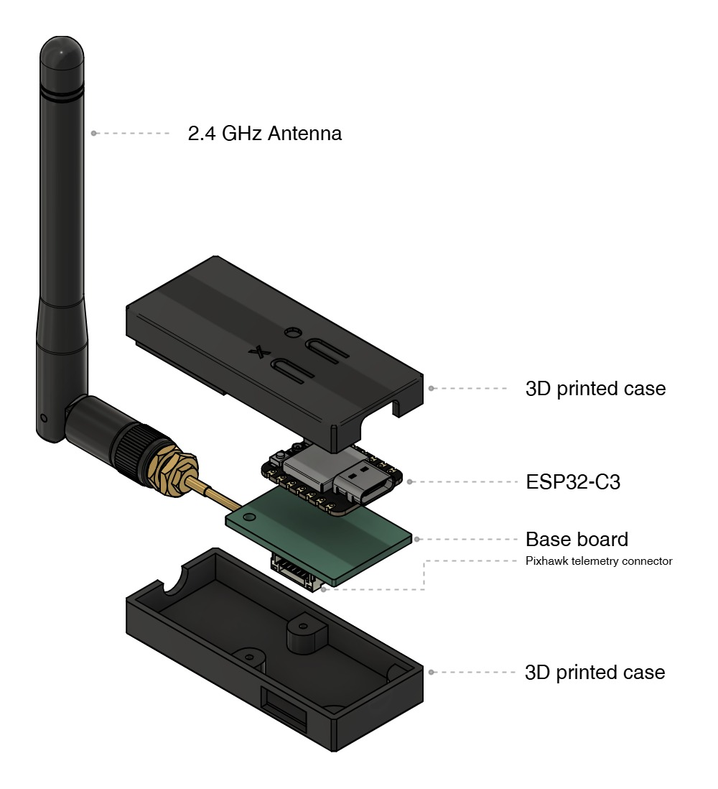

# DroneBridge Radio

A telemetry radio with mesh support powered by [XIAO ESP32-C3](https://wiki.seeedstudio.com/XIAO_ESP32C3_Getting_Started/) and [DroneBridge](https://dronebridge.gitbook.io/docs/dronebridge-for-esp32/untitled).

## Components

<table align="center" width="70%">
  <tr>
    <td align="center">
      
      
The set of components that compose the radio.

    </td>
  </tr>
</table>

List of components:
1. 3D printed case: TBA
2. [XIAO ESP32-C3](https://www.seeedstudio.com/seeed-xiao-esp32c3-p-5431.html)
3. Base board: The base board is a simple PCB that routes the traces from the XIAO to the telemetry connector. It also serves as a mechanical structure that the 3D-printed case attaches to. You can find the files under [DroneBridge Radio - KiCAD files](./dronebridge-radio).
  - If you want to create your own case: [3D model (PCB)](./dronebridge-radio.step).
  - If you want to uder the board use: [Production files](./dronebridge-radio/production), 
  - [Bill Of Materials (BOM)](./dronebridge-radio/production/bom.csv)
  - [Gerber files](./dronebridge-radio/production/dronebridge-radio.zip).
4. The external antenna: Just a 2.4 GHz antenna with a SMA pigtail cable

## Pinout

## Ground Radio Setup

## Air Radio Setup
