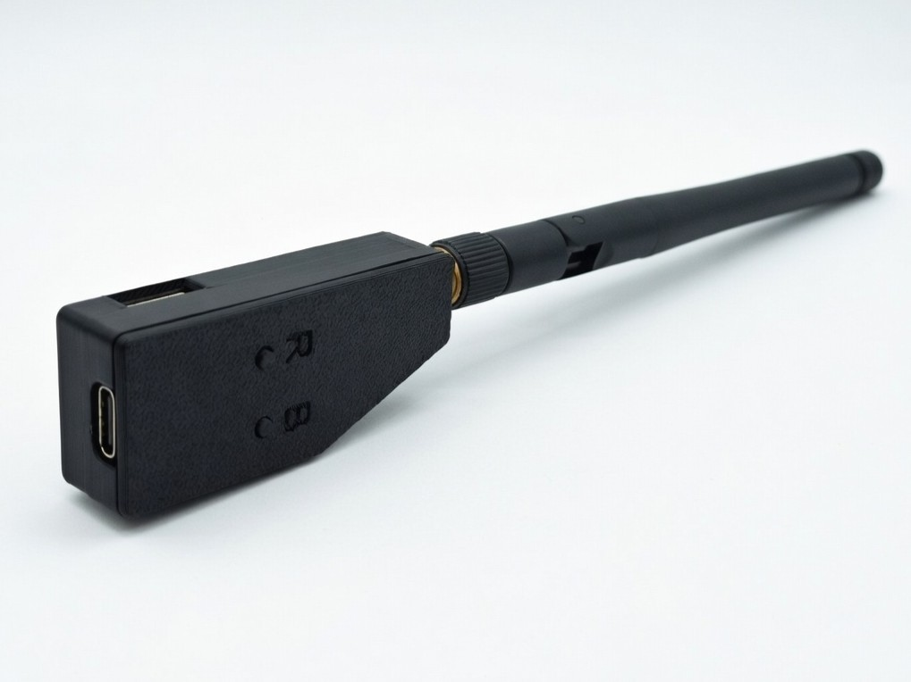
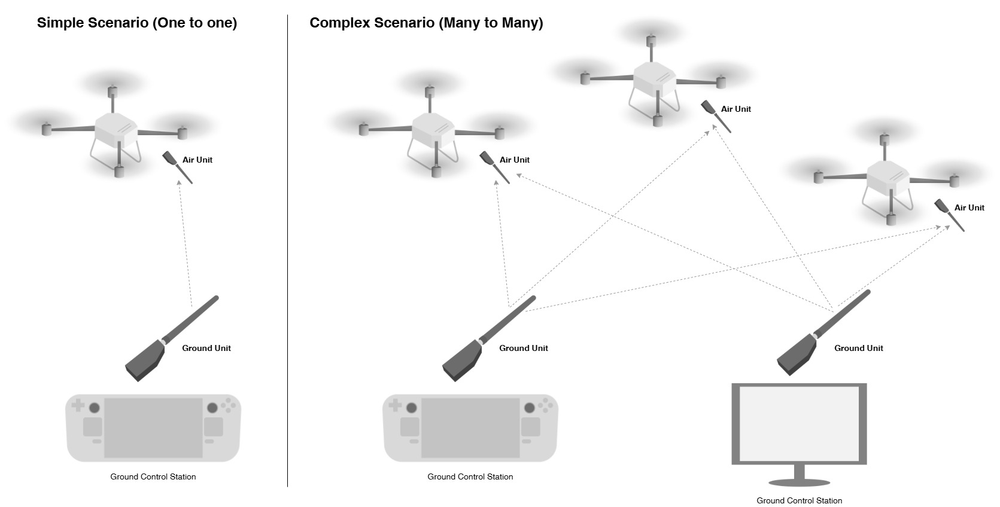
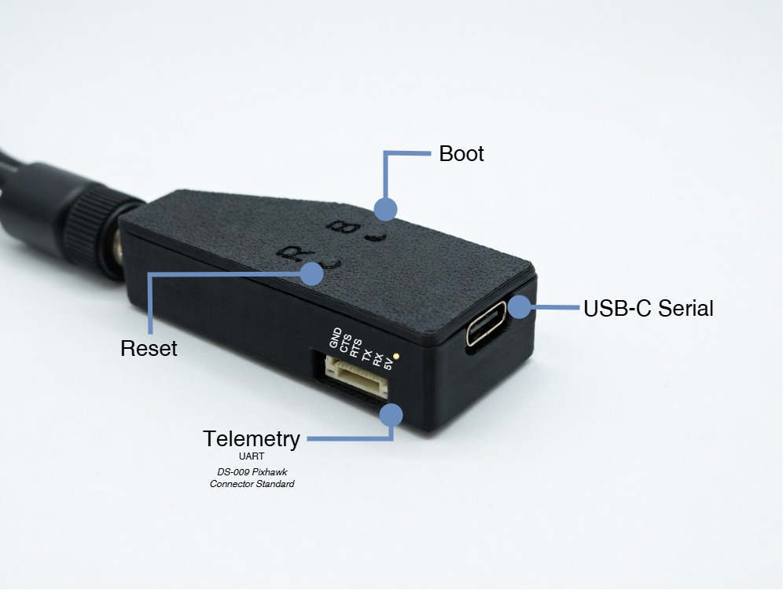

# DroneBridge Radio

A telemetry radio with **mesh support** powered by [XIAO ESP32-C3](https://wiki.seeedstudio.com/XIAO_ESP32C3_Getting_Started/) and [DroneBridge for ESP32](https://dronebridge.gitbook.io/docs/dronebridge-for-esp32/untitled). DIY (Do it yourself) guide under [MAKEME.md](./MAKEME.md).



## Usage

TODO: add scenarios description and explanations
- include the problem with the "common" SiK Radio



## Pinout



## Ground Radio Setup

⚠️ (Only Chrome) ⚠️ Open [DroneBridge Flashing Tool](https://drone-bridge.com/flasher/).

In this case:
```
v2.1.0 (stable)
```

ℹ️ Important ℹ️ 3. Select Firmware flavor **for air radio** is:

```
ESP32-C3 (USBSerial)
```

Settings:

```
ESP32 mode: ESP-NOW LR Mode GND
password: <YOUR_PASSWORD>
Channel: 6

# Serial
UART serial protocol: MAVLink
Maximum packet size: 128
Serial read timeout [ms]: 50
```


## Air Radio Setup

Select DroneBridge for ESP32 Version

In this case:
```
v2.1.0 (stable)
```

ℹ️ Important ℹ️ 3. Select Firmware flavor **for air radio** is:

```
ESP32-C3
```


Settings:

```
ESP32 mode: ESP-NOW LR Mode AIR
password: <YOUR_PASSWORD>
Channel: 6

# Serial
UART RX GPIO: 4
UART TX GPIO: 5
UART RTS GPIO: 6
UART CTS GPIO: 7
UART RTS threshold: 64
UART serial protocol: MAVLink
UART baud: 57600
Maximum packet size: 128
Serial read timeout [ms]: 50
```
