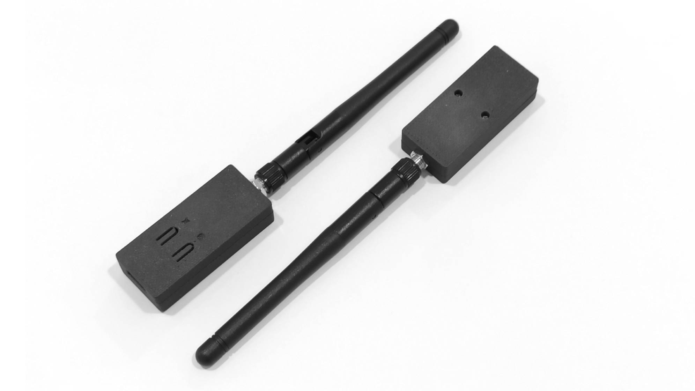
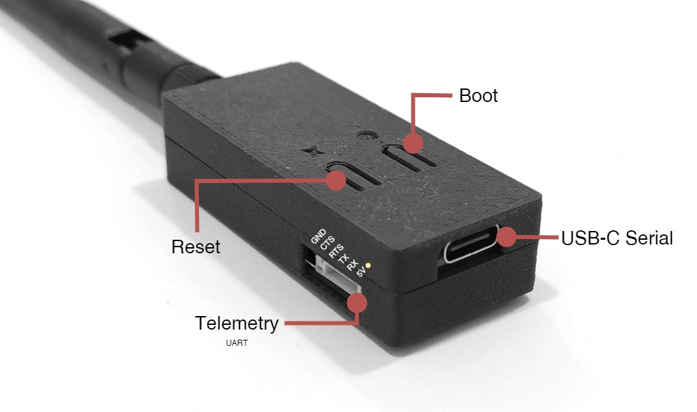

# DroneBridge Radio

A telemetry radio with mesh support powered by [XIAO ESP32-C3](https://wiki.seeedstudio.com/XIAO_ESP32C3_Getting_Started/) and [DroneBridge](https://dronebridge.gitbook.io/docs/dronebridge-for-esp32/untitled).

- [KiCAD files](./dronebridge-radio).
- [3D model (PCB)](./dronebridge-radio.step).
- [Production files](./dronebridge-radio/production), including [BOM](./dronebridge-radio/production/bom.csv), [gerber files](./dronebridge-radio/production/dronebridge-radio.zip) and few more.

## Pinout

## Ground Radio Setup

## Air Radio Setup
